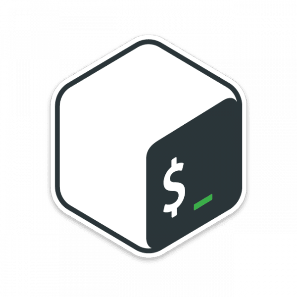

<h1 align="center">Hi! 🙌 I'm Julian Vazquez</h1>
<h3 align="center">A passionate full stack web developer.</h3>

🔭 I’m currently working on [the final project of Henry's academy that is about medical services via online.](https://github.com/Ululette/PF8Samurai)

🌱 I’m currently learning **more about firebase, javascript, supabase and better animations with CSS.**

👨‍🎓 I want to learn **Python, Next.JS, No-SQL Databases**

🎥 My hobbies are:
 - Writing fiction;
 - Listening music;
 - Photography;
 - Collecting;
 - and many other things...
> come and let's discover them together!

<h3 align="left">Connect with me!</h3>

<a href="https://linkedin.com/in/julianvazquezdev" target="_blank">🤠My linkedin profile</a>

<a href="mailto:julianvazquez042@gmail.com" target="_blank">📧 julianvazquez042@gmail.com</a>

<a href="https://api.whatsapp.com/send?phone=5492226556259" target="_blank">🔔 Send me an instant message!!!</a>

<h3 align="left">Technologies I've learned:</h3>

<h4>Main language</h4>

<a href="https://developer.mozilla.org/en-US/docs/Web/JavaScript" target="_blank"> JavaScript</a>

<h4>Front End</h4>

<a href="https://www.w3.org/html/" target="_blank"> HTML5</a>
<a href="https://www.w3schools.com/css/" target="_blank"> CSS3</a>
<a href="https://getbootstrap.com" target="_blank"> Bootstrap</a>
<a href="https://reactjs.org/" target="_blank"> ReactJS</a>
<a href="https://redux.js.org" target="_blank"> Redux</a>
<a href="https://material-ui.com/" target="_blank"> Material-UI</a>

<h4>Back End</h4>

<a href="https://nodejs.org" target="_blank"> NodeJS</a>
<a href="https://expressjs.com" target="_blank"> expressJS</a>
<a href="https://graphql.org" target="_blank"> GraphQL</a>
<a href="https://www.nginx.com" target="_blank"> nginx</a>
<a href="https://webpack.js.org" target="_blank"> Webpack</a>
<a href="https://firebase.google.com/" target="_blank"> Firebase</a> 
<a href="https://supabase.io/" target="_blank"> Supabase</a> 
<a href="https://cloud.google.com" target="_blank"> Google Cloud</a>

<h4>Databases</h4>

<a href="https://www.postgresql.org" target="_blank"> PostreSQL</a>
<a href="https://www.sqlite.org/" target="_blank"> SQLite</a>

<h4>DevOps</h4>

<a href="https://www.gnu.org/software/bash/" target="_blank"> Terminal</a>
<a href="https://www.docker.com/" target="_blank"> Docker</a>

<h4>Testing</h4>

<a href="https://jestjs.io" target="_blank"> Jest</a>
<a href="https://mochajs.org" target="_blank"> Mocha</a>

<h4>Misc</h4>

<a href="https://git-scm.com/" target="_blank"> Git</a>
<a href="https://git-scm.com/" target="_blank"> GitHub</a>
<a href="https://www.arduino.cc/" target="_blank"> Arduino</a>
<a href="https://www.figma.com/" target="_blank"> Figma</a>
<a href="https://heroku.com" target="_blank"> Heroku</a>
<a href="https://www.blender.org/" target="_blank"> Blender</a>
<a href="https://unity.com/" target="_blank"> Unity</a>
<a href="https://postman.com" target="_blank"> Postman</a>
<a href="https://www.linux.org/" target="_blank"> Linux</a> 

&nbsp;

<h4 align='center'>🙏My lucky charm🙏</h4>

